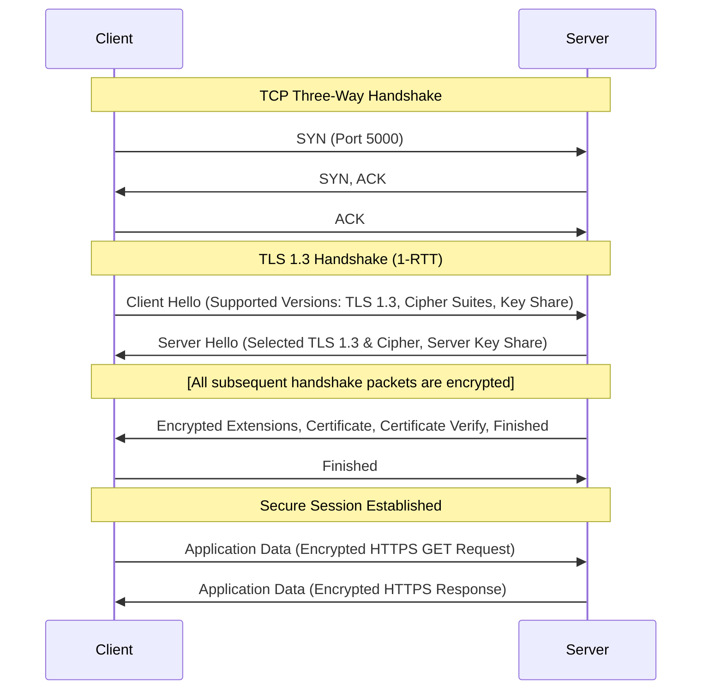

# TLS Handshake and Wireshark Capture Analysis Guide

This guide details how to capture and analyze the secure client-server TLS handshake on your local machine using **Wireshark**.

---

## 1. Capturing Loopback Traffic in Wireshark

Because both our server (`app.py` running on `localhost:5000`) and client (`client.py`) run on the same local computer, the network packets travel via the **loopback interface** (`127.0.0.1`) rather than a physical network card.

### Prerequisites (Windows)
To capture loopback traffic on Windows, Wireshark relies on **Npcap** (installed by default with Wireshark).

### Steps to Capture:
1. Open **Wireshark**.
2. On the start page, you will see a list of capture interfaces. Look for **Npcap Loopback Adapter** (or **Adapter for loopback traffic capture**).
3. Double-click the loopback adapter to start capturing.
4. In the display filter bar at the top, enter the following filter and press Enter:
   ```val
   tcp.port == 5000
   ```
   *This ensures you only see the traffic between your HTTPS client and server, ignoring background noise.*
5. Run the Python client in your terminal:
   ```bash
   python client.py
   ```
6. Once the client prints the response and terminates, click the red **Stop capturing packets** square in the top-left of Wireshark.

---

## 2. TLS 1.3 Handshake Breakdown

When running our Python client and Flask server, they negotiate **TLS 1.3** using the cipher suite `TLS_AES_256_GCM_SHA384`. Here is what you will observe in the packet list in Wireshark:



### Packet 1: Client Hello
* **Protocol Name**: TLSv1.3 (marked as TLSv1.2 in record header for legacy middlebox compatibility).
* **Handshake Type**: `Client Hello (1)`
* **Key Fields to Expand in Wireshark**:
  * `Cipher Suites`: List of cipher suites supported by the client (e.g. `TLS_AES_256_GCM_SHA384`, `TLS_AES_128_GCM_SHA256`).
  * `Extension: supported_versions`: Lists `TLS 1.3 (0x0304)`.
  * `Extension: key_share`: The client speculatively generates a cryptographic key pair (typically using curve `X25519` or `secp256r1`) and transmits its **public key share** immediately. This is the mechanism that allows TLS 1.3 to complete the handshake in just 1 Round Trip Time (1-RTT).
  * `Extension: server_name (SNI)`: Shows `localhost` (indicating the host the client wants to connect to).

### Packet 2: Server Hello
* **Protocol Name**: TLSv1.3
* **Handshake Type**: `Server Hello (2)`
* **Key Fields to Expand in Wireshark**:
  * `Cipher Suite`: The single cipher suite selected by the server (e.g., `TLS_AES_256_GCM_SHA384`).
  * `Extension: supported_versions`: Confirms negotiation of `TLS 1.3 (0x0304)`.
  * `Extension: key_share`: The server's matching public key share.
  * *Note: Using the client's public key share and the server's public key share, both sides calculate the Shared Secret using Diffie-Hellman Key Exchange (ECDHE). All remaining handshake packets are now encrypted.*

### Packet 3: Server Handshake (Encrypted)
In TLS 1.3, this step occurs immediately after the Server Hello and is bundled together as encrypted handshake data:
* **Encrypted Extensions**: The server sends parameters that are not required to configure key exchange (e.g. ALPN parameters confirming HTTP/1.1).
* **Certificate**: The server sends its self-signed certificate chain (`server.crt`). Expanding this reveals the details of your certificate (Country=US, State=State, CN=localhost).
* **Certificate Verify**: The server uses its private key (`server.key`) to sign the handshake log up to this point. The client uses the server's public key (found in the certificate) to verify this signature, proving the server owns the certificate's private key.
* **Finished**: A HMAC tag confirming the integrity of the handshake files.

### Packet 4: Client Finished (Encrypted)
* The client sends its own `Finished` packet to verify it received and validated the server's parameters correctly.

---

## 3. Secure Session Data (Application Data)

Following the `Finished` packets, you will see packets labeled:
* **Protocol**: `Application Data`
* **Info**: `Application Data`
* These packets contain the encrypted HTTP GET request sent by `client.py` and the encrypted HTML response sent back by the Flask server. Expanding these packets in Wireshark will show the payload bytes as completely encrypted, random-looking hex values. This demonstrates that confidentiality is successfully achieved.
