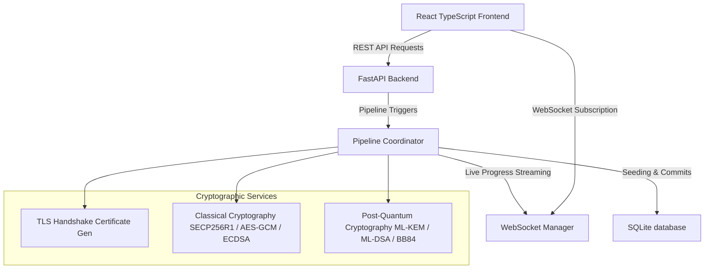

# QuantumShield: Hybrid Quantum-Safe Security Pipeline PoC

QuantumShield is a proof-of-concept hybrid quantum-safe interbank transaction platform. It demonstrates how traditional financial transaction processing can be upgraded to resist quantum attacks by combining classical cryptographic protocols with Post-Quantum Cryptography (PQC) and Quantum Key Distribution (QKD) simulations.

The system allows users to execute interbank fund transfers under two distinct security modes:
1. **Classical Mode**: Standard TLS 1.3, ECDHE (Elliptic Curve Diffie-Hellman Ephemeral) key exchange, AES-256-GCM symmetric encryption, and ECDSA digital signatures.
2. **QuantumShield Mode**: A hybrid pipeline combining simulated **BB84 QKD** (Quantum Key Distribution) with **ML-KEM-768** (Kyber) key encapsulation, AES-256-GCM encryption, and **ML-DSA-87** (Dilithium) post-quantum signatures.

---

## 🏛️ Project Architecture



---

## 🛡️ The 7-Stage Security Transaction Pipeline

Every interbank transfer initiated in the dashboard runs through a real-time, asynchronous 7-stage security workflow. The frontend streams the execution step-by-step via WebSockets, allowing detailed inspection of the cryptographic payloads.

```
┌─────────────────────────────────────────────────────────────┐
│ 1. AUTHENTICATION & ZERO TRUST                              │
│    Verifies account credentials and device authorization    │
└──────────────┬──────────────────────────────────────────────┘
               ▼
┌─────────────────────────────────────────────────────────────┐
│ 2. SECURE TRANSPORT (TLS 1.3)                               │
│    Generates leaf certificates and root trust CA chains      │
└──────────────┬──────────────────────────────────────────────┘
               ▼
┌─────────────────────────────────────────────────────────────┐
│ 3. KEY AGREEMENT & EXCHANGE                                  │
│    Classical: ECDHE (SECP256R1)                             │
│    QuantumShield: BB84 Qubits Simulation + ML-KEM-768       │
└──────────────┬──────────────────────────────────────────────┘
               ▼
┌─────────────────────────────────────────────────────────────┐
│ 4. KEY DERIVATION (HKDF)                                    │
│    Derives session keys using HKDF-SHA256                   │
└──────────────┬──────────────────────────────────────────────┘
               ▼
┌─────────────────────────────────────────────────────────────┐
│ 5. PAYLOAD ENCRYPTION                                       │
│    Encrypts transaction variables using AES-256-GCM         │
└──────────────┬──────────────────────────────────────────────┘
               ▼
┌─────────────────────────────────────────────────────────────┐
│ 6. INTEGRITY & SIGNATURES                                   │
│    Classical: ECDSA (SHA-256)                               │
│    QuantumShield: ML-DSA-87 (Dilithium)                     │
└──────────────┬──────────────────────────────────────────────┘
               ▼
┌─────────────────────────────────────────────────────────────┐
│ 7. ATOMIC SETTLEMENT                                        │
│    Atomically commits transaction and updates ledgers       │
└─────────────────────────────────────────────────────────────┘
```

---

## 📁 Project Directory Structure

```
d:/poc/
├── backend/
│   ├── app/
│   │   ├── routers/             # FastAPI REST endpoints
│   │   │   ├── auth.py          # Session and credentials authentication
│   │   │   ├── crypto.py        # Cryptographic detail queries
│   │   │   ├── tls.py           # TLS certificate handshake endpoints
│   │   │   └── transaction.py   # Transaction initiation and detail trackers
│   │   ├── services/            # Cryptographic & simulation engines
│   │   │   ├── crypto_service.py # ECDH, ECDSA, AES-GCM implementations
│   │   │   ├── pqc_service.py   # BB84, ML-KEM, ML-DSA post-quantum engines
│   │   │   └── tls_service.py   # Certificate generation
│   │   ├── database.py          # SQLite engine configurations
│   │   ├── models.py            # SQLAlchemy Account and Transaction models
│   │   ├── pipeline_coordinator.py # Pipeline step-coordinator state machine
│   │   ├── schemas.py           # Pydantic request/response validation schemas
│   │   └── websocket.py         # Live websocket event broadcaster
│   ├── run.py                   # Dev server boot script (uvicorn)
│   ├── requirements.txt         # Backend Python packages list
│   └── quantumshield.db         # Core database file (sqlite)
│
├── frontend/
│   ├── src/
│   │   ├── components/          # Reusable UI widgets and drawers
│   │   ├── context/             # React Context for active transaction states
│   │   ├── services/            # API client wrapper
│   │   └── main.tsx             # React SPA entrypoint
│   ├── package.json             # NPM dependencies and script utilities
│   ├── index.html               # Main page template
│   └── vite.config.ts           # Bundler settings
```

---

## 🛠️ Installation & Running Guide

### Prerequisites
* Python 3.10 or higher
* Node.js 18.0 or higher (with npm)

---

### 1. Running the FastAPI Backend

1. Navigate to the backend directory:
   ```bash
   cd backend
   ```

2. Create a virtual environment and activate it:
   * **Windows**:
     ```bash
     python -m venv venv
     .\venv\Scripts\activate
     ```
   * **macOS/Linux**:
     ```bash
     python3 -m venv venv
     source venv/bin/activate
     ```

3. Install required libraries:
   ```bash
   pip install -r requirements.txt
   ```

4. Run the backend development server:
   ```bash
   python run.py
   ```
   The backend will start and listen at `http://localhost:8000`. Database tables are automatically initialized and seeded in `quantumshield.db` on startup.

---

### 2. Running the React Frontend

1. Navigate to the frontend directory:
   ```bash
   cd ../frontend
   ```

2. Install dependencies:
   ```bash
   npm install
   ```

3. Start the Vite development server:
   ```bash
   npm run dev
   ```
   Open your browser and navigate to the address shown (usually `http://localhost:5173`).

---

## 👤 Predefined Simulation Credentials

Use the following seeded accounts to test interbank transactions inside the dashboard portal:

| Username | Password | Account Number | Registered Bank |
| :--- | :--- | :--- | :--- |
| **Alice** | `password123` | `123456789` | JPMorgan |
| **Bob** | `password123` | `987654321` | HDFC |

---

## 📝 Technologies Used

* **FastAPI**: Asynchronous Python API web framework.
* **SQLAlchemy & SQLite**: Database ORM and local file storage.
* **Cryptography**: Python library for ECDH, HKDF, ECDSA, and AES-GCM primitives.
* **React + Vite**: High-performance, components-driven web front-end.
* **TypeScript**: Fully typed API and state payloads.
* **WebSockets**: Real-time event streaming from pipeline stages.
