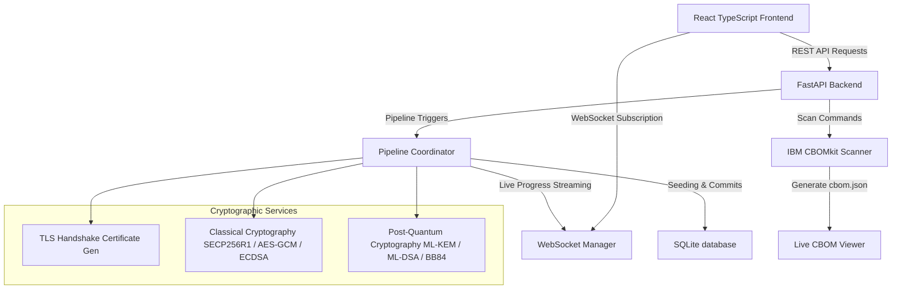

# QuantumShield: Hybrid Quantum-Safe Security Pipeline PoC

QuantumShield is a proof-of-concept hybrid quantum-safe interbank transaction platform. It demonstrates how traditional financial transaction processing can be upgraded to resist quantum attacks by combining classical cryptographic protocols with Post-Quantum Cryptography (PQC) and Quantum Key Distribution (QKD) simulations.

The system allows users to execute interbank fund transfers under two distinct security modes (configured via the permanently visible global header toggle):
1. **Classical Mode**: Standard TLS 1.3, ECDHE (Elliptic Curve Diffie-Hellman Ephemeral) key exchange, AES-256-GCM symmetric encryption, and ECDSA digital signatures.
2. **QuantumShield Mode**: A hybrid pipeline combining simulated **BB84 QKD** (Quantum Key Distribution) with **ML-KEM-768** (Kyber) key encapsulation, AES-256-GCM encryption, and **ML-DSA-65** (Dilithium) post-quantum signatures.

---

## 🏛️ Project Architecture



---

## 🛡️ The 7-Stage Security Transaction Pipeline

Every interbank transfer initiated in the dashboard runs through a real-time, asynchronous 7-stage security workflow. The frontend streams the execution step-by-step via WebSockets, allowing detailed inspection of the cryptographic payloads.

```
┌─────────────────────────────────────────────────────────────┐
│ 1. AUTHENTICATION & ZERO TRUST                              │
│    Verifies account credentials and device authorization    │
└──────────────┬──────────────────────────────────────────────┘
               ▼
┌─────────────────────────────────────────────────────────────┐
│ 2. SECURE TRANSPORT (TLS 1.3)                               │
│    Generates leaf certificates and root trust CA chains      │
└──────────────┬──────────────────────────────────────────────┘
               ▼
┌─────────────────────────────────────────────────────────────┐
│ 3. KEY AGREEMENT & EXCHANGE                                  │
│    Classical: ECDHE (SECP256R1)                             │
│    QuantumShield: BB84 Qubits Simulation + ML-KEM-768       │
└──────────────┬──────────────────────────────────────────────┘
               ▼
┌─────────────────────────────────────────────────────────────┐
│ 4. KEY DERIVATION (HKDF)                                    │
│    Derives session keys using HKDF-SHA256                   │
└──────────────┬──────────────────────────────────────────────┘
               ▼
┌─────────────────────────────────────────────────────────────┐
│ 5. PAYLOAD ENCRYPTION                                       │
│    Encrypts transaction variables using AES-256-GCM         │
└──────────────┬──────────────────────────────────────────────┘
               ▼
┌─────────────────────────────────────────────────────────────┐
│ 6. INTEGRITY & SIGNATURES                                   │
│    Classical: ECDSA (SHA-256)                               │
│    QuantumShield: ML-DSA-65 (Dilithium)                     │
└──────────────┬──────────────────────────────────────────────┘
               ▼
┌─────────────────────────────────────────────────────────────┐
│ 7. ATOMIC SETTLEMENT                                        │
│    Atomically commits transaction and updates ledgers       │
└─────────────────────────────────────────────────────────────┘
```

---

## 📋 Cryptographic Bill of Materials (CBOM)

QuantumShield integrates **IBM CBOMkit (PQCA)** as a real-time directory-level security scanner. 

* **On-Demand Scan**: Clicking **Generate CBOM** in the Security Inspector invokes the compiled `cbomkit-theia` binary against the workspace.
* **Scan Exclusions**: Exclusions are configured via the [.cbomkitignore](.cbomkitignore) file (targeting `node_modules`, `venv`, and build artifacts) ensuring scans complete in under 5 seconds.
* **Discovered Inventory**: The UI decodes and lists auto-discovered **Certificates** and **Cryptographic Libraries** alongside the active transaction's telemetry.
* **Exports**: Supports downloading raw CycloneDX-compliant `cbom.json` files and generating styled interbank security audit reports in **PDF format** (using `jsPDF`).

---

## ⚡ QKD BB84 Simulator Modal

An isolated **QKD Simulator** button (with a red Zap icon) is embedded in the left-hand sidebar navigation:
* Simulates Alice's sent bits and photon polarization bases.
* Simulates Bob's measurement bases and reconciled key extraction.
* Simulates Eve's eavesdropping interventions and computes the resulting Quantum Bit Error Rate (QBER).
* Triggers alert logs if the QBER exceeds the standard **11.0%** threshold, indicating compromised transmission.

---

## 📁 Project Directory Structure

```
d:/poc/
├── .cbomkitignore       # Ignored file patterns for the CBOM kit scan
├── cbomkit-theia/       # Cloned PQCA CBOM scanner source & binary
├── backend/
│   ├── app/
│   │   ├── quantum/
│   │   │   └── router.py # REST endpoints (including /api/quantum/cbom/generate)
│   │   ├── database.py   # SQLite configurations
│   │   ├── models.py     # Account and Transaction database schemas
│   │   ├── main.py       # FastAPI application entrypoint
│   │   └── run.py        # Uvicorn boot configurations
│   └── quantumshield.db  # Core database file (sqlite)
│
├── frontend/
│   ├── src/
│   │   ├── components/
│   │   │   ├── BB84Simulator.tsx # Isolated QKD simulator modal
│   │   │   └── CbomModal.tsx     # Dynamic Live CBOM Viewer
│   │   ├── services/
│   │   │   └── api.ts            # Axios endpoints registry
│   │   └── App.tsx               # Sidebar, dashboard grids and global navigation
│   ├── package.json              # Client dependencies list (including jspdf)
│   └── vite.config.ts            # Bundler configurations
```

---

## 🛠️ Installation & Running Guide

### Prerequisites
* Python 3.10 or higher
* Node.js 18.0 or higher (with npm)
* Go compiler (to compile the scanner binary)

---

### 1. Running the FastAPI Backend

1. Navigate to the backend directory:
   ```bash
   cd backend
   ```

2. Create a virtual environment and activate it:
   * **Windows**:
     ```bash
     python -m venv venv
     .\venv\Scripts\activate
     ```
   * **macOS/Linux**:
     ```bash
     python3 -m venv venv
     source venv/bin/activate
     ```

3. Install required libraries:
   ```bash
   pip install -r requirements.txt
   ```

4. Run the backend development server:
   ```bash
   python run.py
   ```
   The backend will start and listen at `http://localhost:8000`. Database tables are automatically initialized and seeded in `quantumshield.db` on startup.

---

### 2. Running the React Frontend

1. Navigate to the frontend directory:
   ```bash
   cd ../frontend
   ```

2. Install dependencies:
   ```bash
   npm install
   ```

3. Start the Vite development server:
   ```bash
   npm run dev
   ```
   Open your browser and navigate to `http://localhost:5173`.

---

## 👤 Predefined Simulation Credentials

Use the following seeded accounts to test interbank transactions inside the dashboard portal:

| Username | Password | Account Number | Registered Bank |
| :--- | :--- | :--- | :--- |
| **Alice** | `password123` | `123456789` | JPMorgan |
| **Bob** | `password123` | `987654321` | HDFC |

---

## 📝 Technologies Used

* **FastAPI**: Asynchronous Python API web framework.
* **SQLAlchemy & SQLite**: Database ORM and local file storage.
* **Cryptography**: Python library for ECDH, HKDF, ECDSA, and AES-GCM primitives.
* **PQCA cbomkit-theia**: External directory-level CBOM scanner tool.
* **React + Vite**: High-performance, components-driven web front-end.
* **jsPDF**: Frontend client-side PDF document generator.
* **TypeScript**: Fully typed API and state payloads.
* **WebSockets**: Real-time event streaming from pipeline stages.
